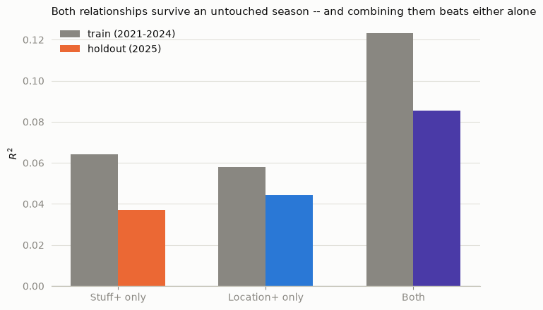
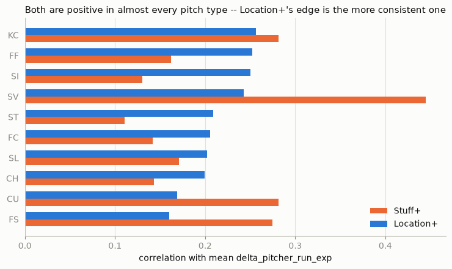
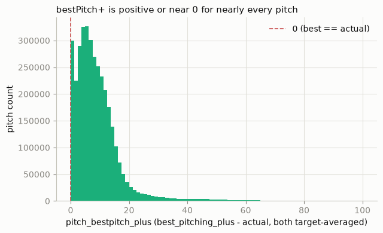
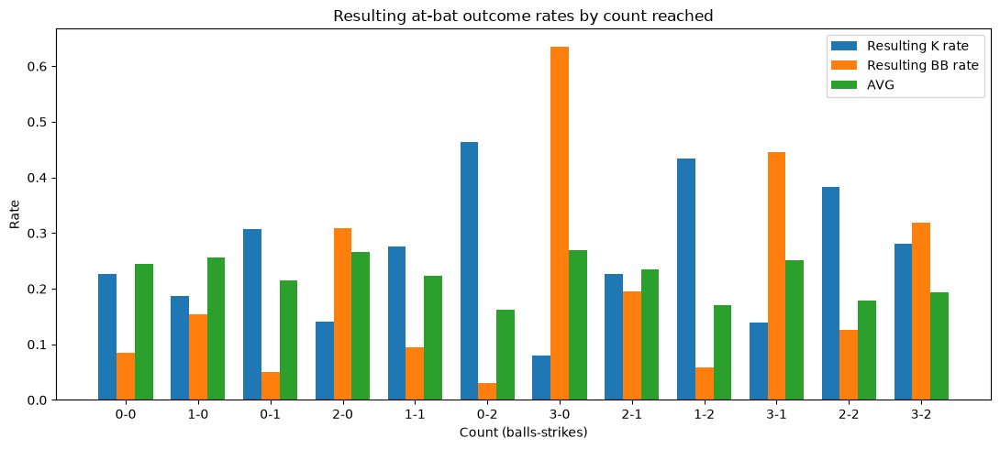
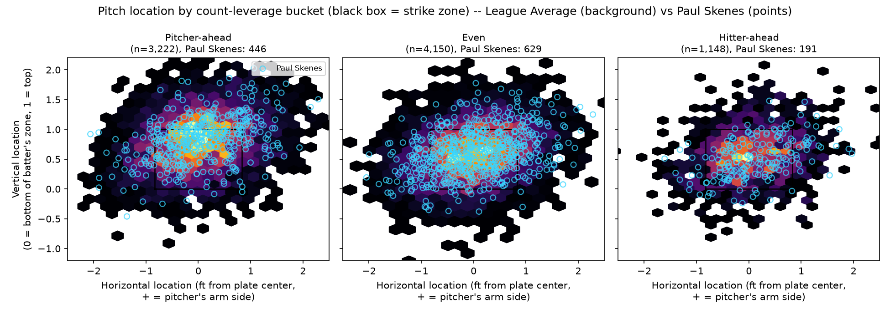
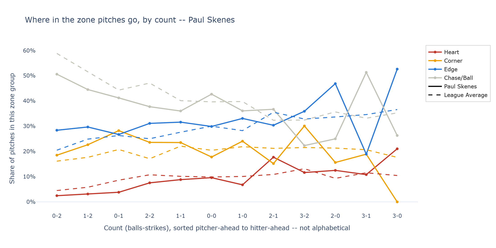

# Baseball Analytics

Two independent baseball analytics projects built on public MLB Statcast pitch-by-pitch data (2021-2025). Each has its own `docs/purpose.md` (goals/design) and `docs/dev_log.md` (a detailed, dated log of what was built, what broke, and why) — start there for the full story behind either project.

---

## Pitching+ (`pitching_plus`)

Model ranking pitches on a 100+ scale using its movement profile (**Stuff+**) and expected run value given location and pitch type (**Location+**). Stuff+ and Location+ feed into **Pitching+** (a jointly-trained model on physics + location/count/situational features together), which is compared against the best score achievable from the pitcher's own arsenal in that same situation (**bestPitch**) to produce **bestPitch+**, a decision-quality metric, not another stuff/location score, to inform pitching strategy. It is also reported as the percent of the best achievable score a pitch (or a pitcher's season) captured.

<p align="center">
  
  
</p>
<p align="center"><sub><b>Left:</b> both signals survive an untouched 2025 season, and combining them beats either alone. <b>Right:</b> both are positive for almost every pitch type, but Location+'s edge over Stuff+ is the more consistent one.</sub></p>

<p align="center">
  
</p>
<p align="center"><sub>bestPitch+ is positive or near zero for nearly every pitch — the gap between a pitcher's actual choice and their own best available option skews toward "left value on the table," not "got unlucky."</sub></p>

See [`pitching_plus/docs/purpose.md`](pitching_plus/docs/purpose.md) for the full design and [`pitching_plus/docs/dev_log.md`](pitching_plus/docs/dev_log.md) for the build history. Exploratory derivations live in `pitching_plus/notebooks/`; the production pipeline is `pitching_plus/scripts/` (run end-to-end via `python -m pitching_plus.scripts.full_pipeline`, or import `add_stuff_plus`/`add_location_plus`/`add_pitching_plus`/`add_bestpitch_plus` directly). Both expect a Statcast pitch-level CSV at `data/MLB_2021-2025.csv` (not included in this repo — pull your own via [pybaseball](https://github.com/jldbc/pybaseball) or Baseball Savant's [Statcast search](https://baseballsavant.mlb.com/statcast_search)); trained model artifacts are cached under `pitching_plus/models/` and regenerate from the data on first run.

---

## Slippery Slope (`slippery_slope`)

Investigation of how a count shapes the rest of an at-bat, in particular whether a first-pitch ball starts a "slippery slope" toward a walk or a more conservative approach from the pitcher. Starts with baseline count-state outcome rates (strikeout/walk/hit rates by count, both on an immediate-pitch and a resulting-at-bat basis), then extends to pitch-location strategy (which count-states get pitched aggressively vs. conservatively, per pitcher and leaguewide) and eventually pitch-type strategy (a "Pitcher Plinko"-style breakdown of arsenal usage by count).

Grew directly out of a `pitching_plus` finding: pitchers with strong Stuff+ but middling results (e.g. Graham Ashcraft, Dustin May) prompted the question of whether pitch quality alone explains outcomes, or whether count-driven strategy is part of the gap.

<p align="center">
  
</p>
<p align="center"><sub>The finding that started the project: falling behind 3-0 or 2-0 doesn't just change the pitch, it changes the outcome — resulting walk rate roughly quadruples between an 0-2 and a 3-0 count.</sub></p>

See [`slippery_slope/docs/purpose.md`](slippery_slope/docs/purpose.md) and [`slippery_slope/docs/dev_log.md`](slippery_slope/docs/dev_log.md). In progress as of the most recent dev log entry — location strategy is underway, pitch-type strategy hasn't started yet.

### Try it live: the Streamlit app

`slippery_slope/scripts/app.py` turns the location-strategy notebook (`notebooks/fastball_location.ipynb`) into an interactive app: pick any pitch type and, optionally, a single pitcher, and see how location shifts across the three count-leverage buckets (Pitcher-ahead/Even/Hitter-ahead) — with a live overlay against league average or another pitcher. It pulls its own small sample live via [pybaseball](https://github.com/jldbc/pybaseball) instead of needing the full `data/MLB_2021-2025.csv`, so it runs standalone.

```
streamlit run slippery_slope/scripts/app.py
```

<p align="center">
  
</p>
<p align="center"><sub>Live app output — Paul Skenes' 2025 fastballs (cyan points) overlaid on the league-average background, split by count leverage. Skenes climbs the zone as the count tilts in his favor and works the arm-side edge once he's fallen behind.</sub></p>

<p align="center">
  
</p>
<p align="center"><sub>The app's companion chart: share of pitches landing in each zone group (Heart/Edge/Corner/Chase) by count. Solid lines are the selected pitcher, dashed lines are the comparison group — here, Skenes leans on the edge of the zone far more than league average once ahead in the count.</sub></p>

### Setup

```
pip install -r requirements.txt        # or requirements-dev.txt to also run the test suite
```

Both projects have a pytest suite: `pytest pitching_plus/tests` and `pytest slippery_slope/tests`.
